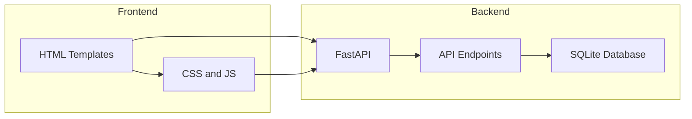

# Web3 Decentralized Marketplace Dashboard

## Overview
The Web3 Decentralized Marketplace Dashboard is a comprehensive platform designed to facilitate peer-to-peer transactions in a decentralized environment. This project leverages modern web technologies to offer a seamless user experience for buying and selling products. It aims to solve the challenges of centralized marketplaces by providing a decentralized alternative that ensures transparency, security, and user autonomy. The platform is ideal for users who value privacy and control over their digital identities while engaging in online commerce.

The dashboard offers a user-friendly interface that allows users to manage their profiles, browse product listings, and view transaction histories. It integrates with blockchain technology to ensure secure and immutable transaction records, making it an ideal solution for tech-savvy individuals and businesses looking to leverage the benefits of decentralized commerce.

## Features
- **User Profiles**: Manage personal information and view transaction history.
- **Product Listings**: Browse and search for products available in the marketplace.
- **Transaction Management**: View detailed transaction records for accountability and transparency.
- **Responsive Design**: Optimized for both desktop and mobile devices.
- **Secure Database**: Utilizes SQLite for efficient data storage and retrieval.
- **Dynamic Content Loading**: Asynchronously fetches and displays data for a smooth user experience.
- **Form Validation**: Ensures data integrity by validating form inputs on the client side.

## Tech Stack
| Technology   | Description                                |
|--------------|--------------------------------------------|
| FastAPI      | Web framework for building APIs            |
| Uvicorn      | ASGI server for running FastAPI applications|
| SQLAlchemy   | ORM for database interactions              |
| Jinja2       | Templating engine for rendering HTML       |
| SQLite       | Database for storing application data      |
| Docker       | Containerization for deployment            |

## Architecture
The project follows a modular architecture that separates the backend logic from the frontend presentation. The backend, built with FastAPI, handles API requests and interacts with the SQLite database using SQLAlchemy. The frontend is served using Jinja2 templates, which render dynamic HTML pages based on user interactions.



## Getting Started

### Prerequisites
- Python 3.11+
- pip (Python package manager)
- Docker (optional for containerized deployment)

### Installation
1. Clone the repository:
   ```bash
   git clone https://github.com/yourusername/web3-decentralized-marketplace-dashboard-auto.git
   cd web3-decentralized-marketplace-dashboard-auto
   ```
2. Install the required Python packages:
   ```bash
   pip install -r requirements.txt
   ```

### Running the Application
1. Start the FastAPI server:
   ```bash
   uvicorn app:app --reload
   ```
2. Visit the application at `http://localhost:8000`

## API Endpoints
| Method | Path              | Description                         |
|--------|-------------------|-------------------------------------|
| GET    | /                 | Home page                           |
| GET    | /profile          | User profile page                   |
| GET    | /products         | List all products                   |
| GET    | /product/{id}     | Product detail page                 |
| GET    | /transactions     | List all transactions               |
| GET    | /api/users        | Retrieve all users                  |
| POST   | /api/users        | Create a new user                   |
| GET    | /api/products     | Retrieve all products               |
| GET    | /api/transactions | Retrieve all transactions           |

## Project Structure
```
web3-decentralized-marketplace-dashboard-auto/
├── app.py                # Main application file with API logic
├── Dockerfile            # Docker configuration for containerization
├── requirements.txt      # Python dependencies
├── start.sh              # Script for starting the application
├── static/               # Static files (CSS, JS)
│   ├── css/
│   │   └── style.css     # Stylesheet for the application
│   └── js/
│       └── main.js       # JavaScript for client-side interactions
├── templates/            # HTML templates for rendering pages
│   ├── home.html
│   ├── product_detail.html
│   ├── products.html
│   ├── profile.html
│   └── transactions.html
└── test.db               # SQLite database file
```

## Screenshots
*Screenshots of the application interface will be added here.*

## Docker Deployment
1. Build the Docker image:
   ```bash
   docker build -t marketplace-dashboard .
   ```
2. Run the Docker container:
   ```bash
   docker run -d -p 8000:8000 marketplace-dashboard
   ```

## Contributing
Contributions are welcome! Please fork the repository and submit a pull request with your changes. Ensure that your code follows the project's coding standards and includes appropriate tests.

## License
This project is licensed under the MIT License. See the LICENSE file for more information.

---
Built with Python and FastAPI.